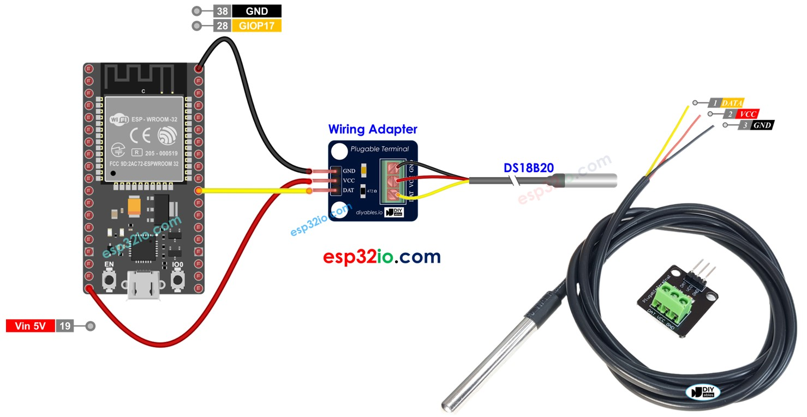
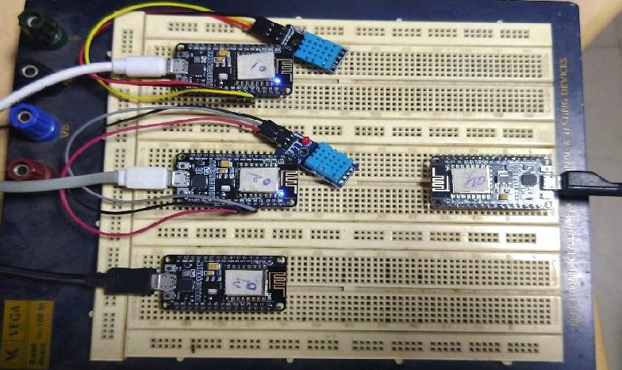

# Aqua-Farming-using-ESP32

[Mesh Network Website](https://randomnerdtutorials.com/esp-mesh-esp32-esp8266-painlessmesh/)

## Temperature Sensor Image

<!--  -->

## Installation Instruction

_Download Arduino IDE from the official website_

**Install Board in Board Manager:**
- `esp32` by Espressif systems 
- `esp8266` by ESP8266 Community [Board URL](http://arduino.esp8266.com/stable/package_esp8266com_index.json) [Reference Website](https://randomnerdtutorials.com/how-to-install-esp8266-board-arduino-ide)

**Install in Library Manager:**
- `Blynk` for BlynkSimpleEsp32
- `ArduinoJson`
- `painlessMesh`
- `AsyncTCP`
- `OneWire`
- `DallasTemperature`
- `ESPAsyncTCP` for ESP8266

*If you are not able to see the COM Port in device manager after connecting your ESP32*

Download and Install [CP210x Windows Drivers](https://www.silabs.com/developers/usb-to-uart-bridge-vcp-drivers?tab=downloads)

**Note:** The name of the driver is written on the chip of ESP32 Board

## References
https://www.researchgate.net/figure/Wireless-networking-with-a-star-topology_fig4_374005972

